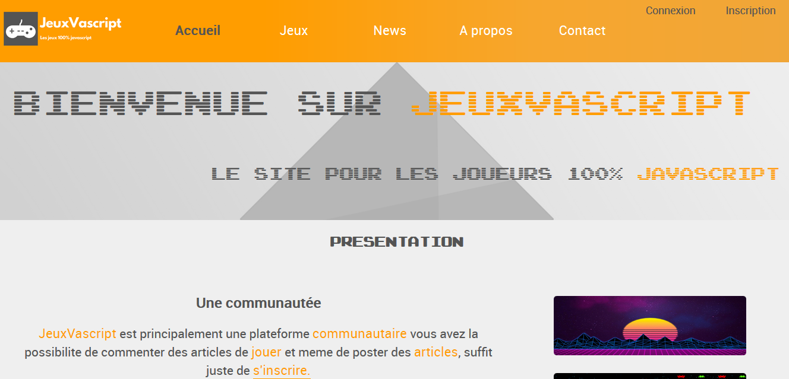

# JeuxVascript

    

    

## Project Documentation

### language used

* HTML5
* CSS3
* JavaScript
* PHP

### title project

JeuxVascript

### Author 

PERRIGUEY Yohann

### Overview

this section will contain the description of the project as well as the functionality

functionality : 

* functionality 1
* functionality 2
* functionality 3

### Running

this section describes how to install and start the application