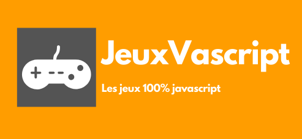

# JeuxVascript

<div align="center">
    
</div>

<div align="center">
    
</div>

## Documentation du projet

### language utilisé

* HTML5
* CSS3
* JavaScript
* PHP

### titre du projet

JeuxVascript

### auteur 

PERRIGUEY Yohann

### note codeClimate

[](https://codeclimate.com/github/yohann-kevin/JeuxVascript/maintainability)

### Aperçu du projet

JeuxVascript est une plateforme communautaire
principalement orienté vers les jeux indépendant nous 
mettons a disposition de la communauté un éspace blog pour que les utilisateurs 
puisses s'éxprimer librement et discuter de leur jeux vidéo indépendant préféré.

Le site possède aussi ces propres jeux entièrement fait en javascript.

Nos jeux : 

* Snake
* Battleship
* Power 4

Les fonctionnalités à venir : 

* Mise en place d'une api google connect (en attente d'une réponse des services de google)
* Mise en place d'une page stats qui permmetra aux utilisateurs de consulter leur score et leur statistique sur différent jeux
* Mise en place d'une fonction permettant de retailler les images
* Rédaction du fichier .htaccess

### démarrer le projet

Pour commencer vous allez devoir cloné le projet via le bouton (clone or download) en haut à droite
ou via git en utilisant la commande :

```

git clone

```

Ensuite vous devrez faire un import de la base de donnée présente dans le dossier (sql)
vous y trouvez aussi un diagramme vous éxpliquants comment fonctionne la base de donnée

=> [BDD](app/public/sql/db-jxs.sql)  

=> [diagramme](app/public/sql/diagramDB.jpg)

Vous y trouverez le fichier (db-jxs.sql). Vous n'avez plus qu'a l'importer sur 
votre phpMyAdmin (ou autre application de gestion de base de donnée sql ex: laragon) 

!! Attention !! 

Si vous modifier le nom de la base de donnée de base vous devrez le modifier aussi
dans le fichier manager.php qui se trouve dans le dossier (models)

=> [Manager.php](app/models/Manager.php)

``` php

namespace Project\models;
class Manager {
    // gère la connection a la base de donnée
    protected function dbConnect() {
        try {
            $bdd = new \PDO('mysql:host=localhost;dbname=Votre_nom_de_base_de_donnée;charset=utf8', 'root', '');
            return $bdd;
        } catch (Exception $e){
            die('Erreur : ' . $e->getMessage());
        }
    }
}

```
Et pour finir vous n'aurez qu'a lancer phpMyAdmin 
aller sur votre navigateur et taper localhost vous y trouverez le projet

Sinon vous pouvez directement voir le projet sur :
[JeuxVascript.fr](https://jeuxvascript.fr/)
